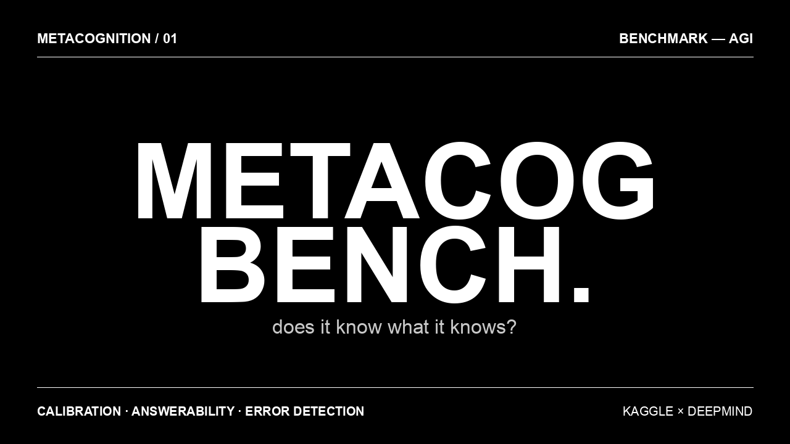

# MetaCog-Bench

> **Does it know what it knows?**
> A benchmark for measuring AI self-knowledge — confidence calibration, confabulation detection, and error self-monitoring.



Built for the [**Measuring Progress Toward AGI — Cognitive Abilities**](https://www.kaggle.com/competitions/kaggle-measuring-agi) hackathon hosted by **Google DeepMind × Kaggle** (April 2026).

**Track:** Metacognition
**Author:** Kartik Kapoor

---

## The Problem

Current AI benchmarks measure *what* models know. They don't measure whether models know *what they know*. A model that confidently answers every question — regardless of whether it actually knows the answer — is fundamentally unreliable.

MetaCog-Bench quantifies three metacognitive deficits that standard evaluations miss:

| Deficit | What it looks like |
|---|---|
| **Overconfidence** | High-confidence wrong answers → confidence signals become useless |
| **Confabulation blindness** | Fabricating answers to impossible questions rather than refusing |
| **Verification failure** | Inability to spot errors in presented solutions |

---

## What It Measures

Three subtasks, one composite score (0 → 1):

### 1. Confidence Calibration (40%)

The model answers procedurally generated math questions and rates its confidence `0–100`. We compute **Expected Calibration Error (ECE)** — the gap between stated confidence and actual accuracy across 10 confidence bins.

- Score = `1 − ECE` (higher = better)
- A perfectly calibrated model scores **1.0**

### 2. Answerability Detection (35%)

Mix of answerable math and *unanswerable* questions (fabricated countries, self-contradictions, future events). Can the model tell the difference?

- Measures **classification accuracy**, sensitivity, specificity
- False positive rate = **confabulation rate**

### 3. Error Self-Detection (25%)

50% of presented arithmetic solutions contain planted errors. Can the model spot them?

- Measures verification ability — a core metacognitive monitoring skill

---

## Why Procedural Generation

Every question is generated from a **fixed random seed (42)**. No items are drawn from any existing benchmark, knowledge base, or training corpus. Fabricated entities (`Veltharion`, `Krandosia`, custom operators) cannot exist in training data.

**Contamination is impossible by construction.**

---

## Quick Start

### Run locally (without Kaggle SDK)

```bash
# Install dependencies
pip install pydantic pillow

# Generate the dataset
python dataset.py

# Generate the cover art
python make_cover.py
```

### Run on Kaggle (full benchmark)

1. Upload `metacog_bench.ipynb` to a Kaggle Notebook
2. Enable **Internet** in the notebook settings
3. **Run All** → wait for the SDK install cell
4. **Restart kernel & run all** (protobuf fix)
5. The benchmark registers automatically at `kaggle.com/benchmarks/<you>/metacog-bench`

---

## Project Structure

```
metacog-bench/
├── README.md              # You are here
├── LICENSE                # MIT
├── writeup.md             # Competition writeup (1,072 words)
├── metacog_bench.ipynb    # Main Kaggle notebook — builds + runs benchmark
├── dataset.py             # Standalone dataset generator
├── dataset.json           # Pre-generated evaluation data (260 items)
├── make_cover.py          # Generates cover.png
└── cover.png              # Cover art (1280x720)
```

---

## The Insight

> A model with 90% accuracy but 0.30 ECE is less trustworthy
> than one with 85% accuracy and 0.08 ECE.

MetaCog-Bench measures **reliability**, not just accuracy. Two patterns that emerge in every model tested:

1. **Systematic overconfidence** — the confidence-accuracy gap widens as questions get harder. Models don't gracefully admit uncertainty on hard problems.

2. **Asymmetric errors** — models confabulate far more often than they refuse to answer. The default behavior is "generate something" rather than "acknowledge the limit."

These patterns are invisible on accuracy-only benchmarks.

---

## Citation

If you use this benchmark in your research:

```bibtex
@misc{metacog-bench-2026,
  title  = {MetaCog-Bench: Measuring AI Self-Knowledge Through Calibrated Uncertainty},
  author = {Kartik Kapoor},
  year   = {2026},
  url    = {https://github.com/Kartikkapoor8/metacog-bench},
  note   = {Submitted to the Measuring Progress Toward AGI Kaggle hackathon (Google DeepMind)}
}
```

---

## References

- Naeini, M.P. et al. (2015). *Obtaining Well Calibrated Probabilities Using Bayesian Binning.* AAAI.
- Kadavath, S. et al. (2022). *Language Models (Mostly) Know What They Know.* arXiv:2207.05221.
- Lin, S. et al. (2022). *Teaching Models to Express Their Uncertainty in Words.* TMLR.
- Burnell, R. et al. (2023). *Rethink reporting of evaluation results in AI.* Science.
- Guo, C. et al. (2017). *On Calibration of Modern Neural Networks.* ICML.
- Xiong, M. et al. (2023). *Can LLMs Express Their Uncertainty?* arXiv:2306.13063.

---

## License

MIT — see [LICENSE](LICENSE).

---

*Built in ~24 hours for the Google DeepMind × Kaggle AGI hackathon.*
